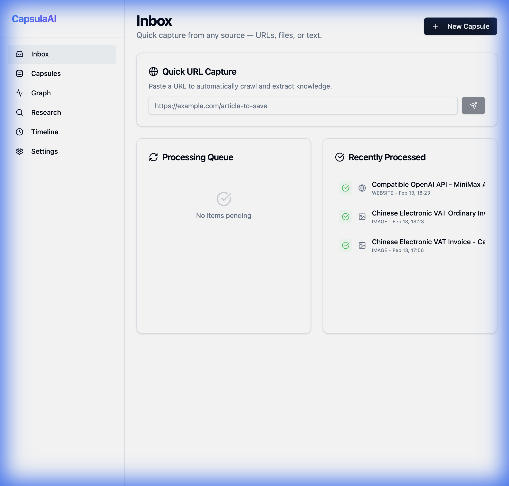
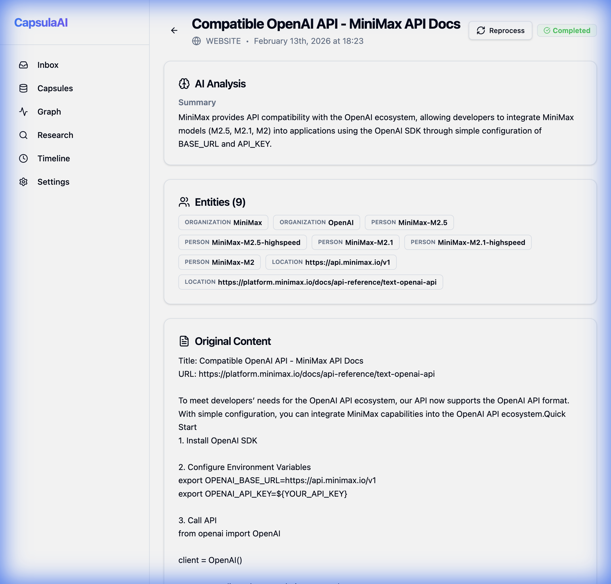
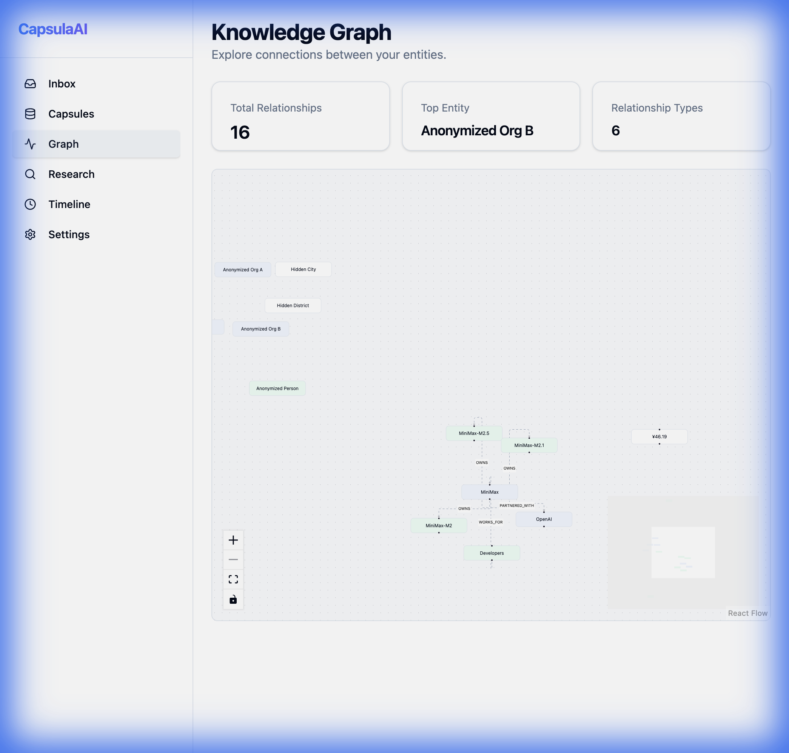
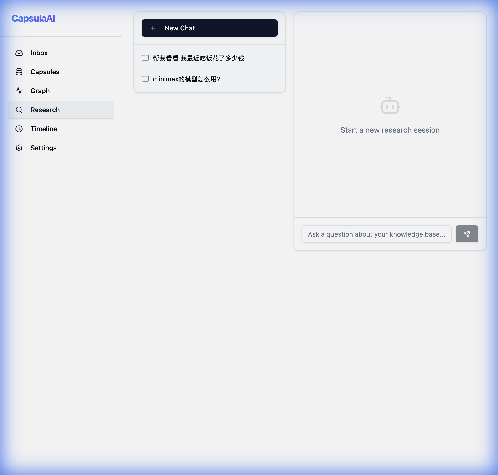
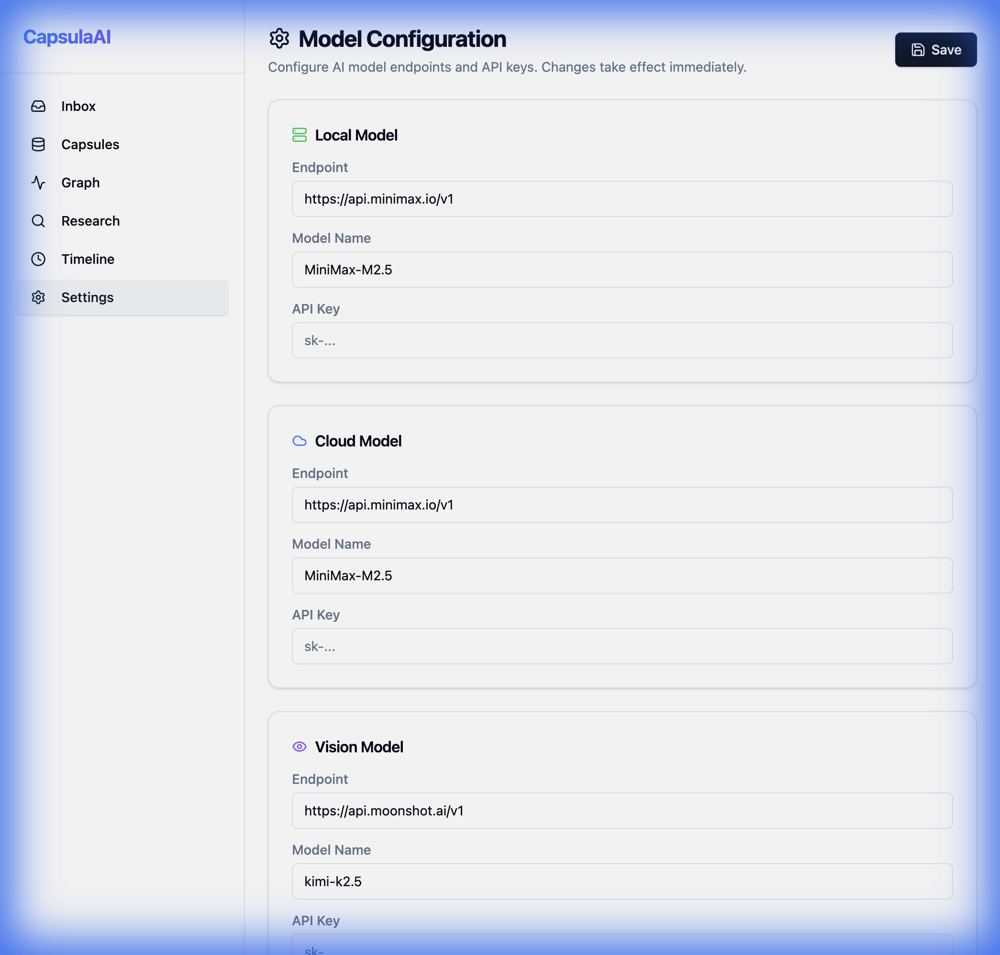

# CapsulaAI

CapsulaAI is an intelligent knowledge management system that automatically processes information from various sources (URLs, files, images) using advanced Vision Language Models (VLM) and Large Language Models (LLM) to build a structured knowledge graph and provide research capabilities.

## Key Features

- **Multi-Source Ingestion**: Quickly capture knowledge from URLs, files, or text.
- **VLM-Powered Analysis**: Uses state-of-the-art Vision models (Kimi-k2.5) to process images and complex documents.
- **Knowledge Graph**: Automatically extracts entities and relationships to visualize your knowledge base using React Flow.
- **AI Research**: Chat with your local knowledge base using RAG (Retrieval-Augmented Generation).
- **Flexible Model Configuration**: Configure local and cloud models (MiniMax, Moonshot, etc.) directly in the UI.
- **Reprocess Capability**: Re-run AI analysis on existing capsules with updated configurations to improve extraction results.

## Visual Tour

### Dashboard
The central hub for capturing new information and monitoring processing status.


### Capsule Detail
Deep dive into extracted knowledge, AI summaries, and entity relationships.


### Knowledge Graph
Visualize how different pieces of information are connected across your entire knowledge base.


### Research
Interact with your knowledge base through an AI-powered chat interface.


### Settings
Seamlessly configure your AI endpoints and API keys for both local and cloud models.


## Getting Started

### Prerequisites
- Node.js & npm
- API Keys for supported models (e.g., Moonshot Kimi, MiniMax)

### Installation
1. Clone the repository:
   ```bash
   git clone <repository-url>
   ```
2. Install dependencies for both `web` and `orchestrator`:
   ```bash
   cd orchestrator && npm install
   cd ../web && npm install
   ```
3. Set up environment variables in `orchestrator/.env` (use the Settings page in the UI to manage keys).

### Running the App
1. Start the orchestrator (Backend):
   ```bash
   cd orchestrator && npm run dev
   ```
2. Start the web frontend:
   ```bash
   cd web && npm run dev
   ```
3. Open `http://localhost:5173` in your browser.

## Technologies Used
- **Frontend**: React, TypeScript, Vite, Tailwind CSS, Shadcn UI, React Flow.
- **Backend**: Node.js, Express, ts-node-dev.
- **AI**: Integrations with Moonshot (VLM) and MiniMax (LLM).
