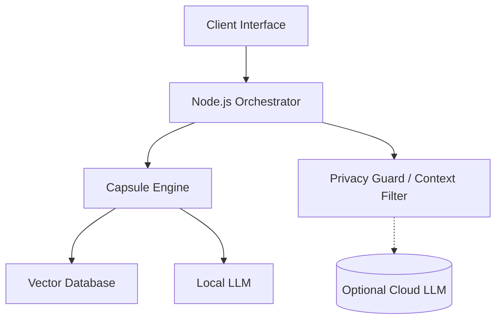

# 🧠 CapsulaAI: The Private AI Memory Engine

### **Local-First Intelligence. Your Knowledge. Your Control.**

> **⚡ One-Line Pitch:** > `CapsulaAI = PrivateGPT × Memory Graph × Local-First Knowledge OS`

---

## 🚀 Capture Everything. Structure Automatically. Search Privately.

**CapsulaAI** 是一款本地优先（Local-First）的 AI 系统，它能将你的截图、笔记、文档和灵感转化为**结构化知识胶囊（Knowledge Capsules）**。它不只是一个聊天机器人，它是你个人的私有记忆层，随你一同演进。

* **🔒 无强制云端**：数据不出本地，隐私并非选项，而是底层架构。
* **🚫 无隐藏遥测**：不监控你的行为，不上传你的隐私。
* **🔓 无平台锁定**：你的记忆以标准格式存储，归你所有。

---

## 🌌 The Manifesto (我们的宣言)

AI 正在改变我们的思考与工作方式，但目前的 AI 系统大多为云端而生，而非为你。你的思想、文档和记忆被发送到远方处理，存储在失控的地方。

**CapsulaAI 的存在是为了实现另一种未来：**

* AI 运行在**你身边**，而非你之上。
* 知识归属于其**创造者**，而非平台。
* 记忆是一个**生命系统**，而非一段聊天记录。

---

## ✨ 核心能力：从碎片到智能

### 1. 🧩 知识胶囊 (Knowledge Capsules)

不再是死板的文件，CapsulaAI 将原始信息转化为结构化记忆：

* **多模态理解**：支持截图 OCR、文档解析与视觉知识提取。
* **自动标签与分类**：系统自动识别实体与上下文关系。

### 2. 🔍 私有语义搜索

你可以像询问老友一样提问：

> “我去年关于‘私有 AI’有哪些想法？”
> “我东京旅行时见过谁？”

### 3. 🧠 混合智能 (Hybrid Intelligence)

* **本地优先**：大部分推理由本地 LLM 处理。
* **可选云端**：仅在处理长逻辑推理且用户明确授权时，才会发送极简的上下文。

---

## 🚀 当你开始使用 CapsulaAI...

| 你投入 (Input) | CapsulaAI 转化为 (Output) | 你的收获 (Value) |
| --- | --- | --- |
| 护照截图 / 会议速记 | **结构化胶囊** | 永久、合规的数字备份 |
| 突发奇想的灵感 | **语义记忆** | 自动关联相关旧想法 |
| 混乱的项目文档 | **知识图谱** | 随时通过自然语言检索 |

---

## 🔒 核心原则

* **设计即隐私 (Private by Architecture)**：隐私不是开关，而是通过本地 LLM 和自托管部署实现的硬约束。
* **记忆而非聊天 (Memory, Not Chat)**：聊天机器人会遗忘，而 CapsulaAI 通过**实体识别**与**语义关联**构建长效记忆图谱。
* **作为基础设施的知识**：它不是一个笔记应用，而是一个其他系统可以调用的**记忆引擎**。

---

## 🏗 技术架构



---

## 🧭 路线图

* **Phase 1 — 记忆基石**：胶囊创建、本地 AI 处理、私有语义搜索。
* **Phase 2 — 智能层**：实体系统（人/组织/文档）、动作提取、收件箱智能化。
* **Phase 3 — 知识演进**：记忆图谱可视化、时间轴记忆、自进化 AI 存储。

---

## 🛠 快速开始

```bash
# 克隆仓库
git clone https://github.com/yourname/CapsulaAI
cd CapsulaAI

# 启动本地环境
docker compose up -d

```

访问 `http://localhost:3000` 即可开始构建你的私有大脑。

---

## 💼 商业愿景与贡献

CapsulaAI 既是一个高影响力的开源系统，也是私有 AI 基础设施的基石。我们计划探索企业级本地部署、自托管许可以及可选的增强型推理服务。

**如果你相信 AI 应该为你服务，而不是消耗你的数据，请为我们点亮一颗 ⭐。**

---

**Capsula** (拉丁语) — 意为“小容器”。

不仅是为了存储信息，更是为了守护记忆。
