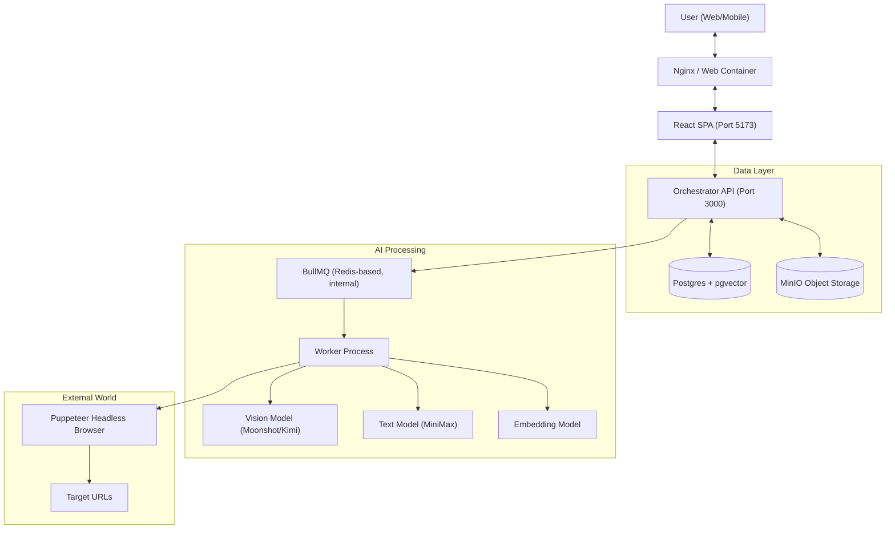
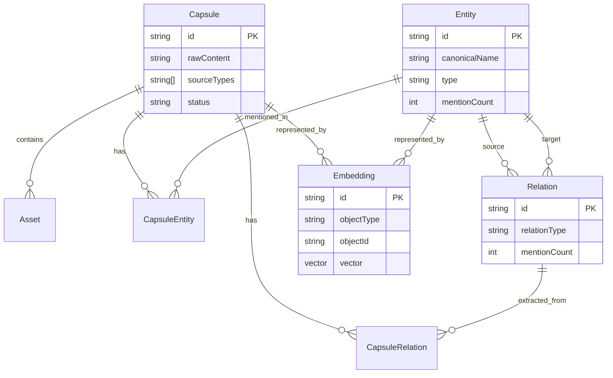

# CapsulaAI Technical Design

## 1. System Overview

CapsulaAI is a **Local-First Knowledge Management System** designed to capture, structure, and retrieve personal memory with privacy at its core. It transforms unstructured data (text, images, URLs) into a structured Knowledge Graph through an AI-powered pipeline.

### Core Philosophy
- **Local-First**: All data (DB, Objects, Vectors) stored locally.
- **Privacy-Centric**: AI inference happens on user-controlled endpoints (Local LLM or Private Cloud API).
- **Graph-Based**: Knowledge is stored as interconnected entities, not just documents.

---

## 2. Architecture

The system follows a modular microservices-like architecture, orchestrated via Docker Compose.

### Components
1.  **Frontend (Web)**
    *   **Stack**: React, TypeScript, Vite, TailwindCSS, Shadcn UI.
    *   **State**: React Query (TanStack Query) for async data, Zustand for local state.
    *   **Key Libraries**: `reactflow` (Graph), `lucide-react` (Icons).

2.  **Orchestrator (Backend)**
    *   **Stack**: Node.js, Express, TypeScript.
    *   **Role**: API Gateway, Business Logic, AI Orchestration.
    *   **Queue**: In-memory (or Redis-backed via BullMQ) job queue for async AI tasks.

3.  **Database (PostgreSQL)**
    *   **Extensions**: `pgvector` for semantic search.
    *   **ORM**: Prisma.
    *   **Role**: Relational data (User, Capsule, Entity) + Vector Embeddings.

4.  **Object Storage (MinIO)**
    *   **Protocol**: S3-compatible.
    *   **Role**: Storing raw assets (images, PDFs, screenshots).

---

## 3. Data Model (Memory Engine V1)

### 3.1 Core Entities

#### Capsule
The fundamental event/trigger unit of memory. It captures data from the outside world.
- `id`: UUID
- `rawContent`: Raw text or OCR result.
- `summary`: Short summary of the capsule.
- `sourceTypes`: Array of strings (e.g., `["IMAGE", "WEBSITE"]`).
- `status`: `PENDING`, `PROCESSING`, `COMPLETED`, `FAILED`.

#### Entity (The Skeleton)
The stable nodes of the Knowledge Graph extracted from Capsules.
- `id`: UUID
- `type`: `PERSON`, `ORG`, `LOCATION`, `EVENT`, `TOPIC`, `DOCUMENT`, etc.
- `canonicalName`: Display name of the entity.
- `normalizedName`: Lowercase name for deduplication.
- `mentionCount`: How many times this entity has been mentioned across capsules.

#### Relation (The Structure)
Directed edges connecting two Entities.
- `id`: UUID
- `fromEntityId` & `toEntityId`: Links to Entity nodes.
- `relationType`: The type of relationship (e.g., `WORKS_AT`, `LOCATED_IN`, `FOUNDER_OF`).
- `strength`: Confidence score.
- `mentionCount`: Number of times this relation was observed.

#### Intermediate Linkers & Vectors
- **`CapsuleEntity` & `CapsuleRelation`**: Linkers that track exactly which Capsule generated which Entity or Relation, allowing for full traceability and timeline views.
- **`Embedding`**: Polymorphic vector storage that links to either a `Capsule` or an `Entity` for semantic search.

### 3.2 Schema Visualization

---

## 4. AI Pipeline

The pipeline transforms raw input into structured knowledge.

1.  **Ingestion**: User uploads file(s), inputs a URL directly, or writes text containing URLs.
    - *Action*: Files stored in MinIO. Capsule created with status `PENDING`.
2.  **Scheduling**: Orchestrator picks up `PENDING` capsule.
3.  **Multi-Modal Processing (Worker)**:
    - **Crawling**: Implicitly detect any explicit URLs in the text -> Headless browser/Crawler extracts text.
    - **Vision (VLM)**: Iteratively pass *all* attached assets (images/PDFs) to the Vision Model (Kimi) for OCR and layout description.
    - **Aggregation**: Combine user input, crawled text, and OCR outputs into a mega-string.
    - **Analysis (LLM)**: Mega-string sent to LLM (MiniMax) with the "Extraction Prompt".
        - *Output*: JSON containing Summary, Entities, Relations, Tags.
    - **Embedding**: Summary text sent to Embedding Model -> Vector.
4.  **Storage**:
    - Update Capsule with Summary & Vector.
    - Upsert Entities & Relations to Graph (deduplication based on name/type).
5.  **Completion**: Status set to `COMPLETED`. Real-time update via WebSocket/Polling.

---

## 5. Security & Privacy

### API Key Management
- Keys are stored locally in `orchestrator/data/settings.json`.
- Not committed to Git (via `.gitignore`).
- Environment variables (`.env`) serve as default/template.

### Data Sovereignty
- All data resides in `postgres_data` and `minio_data` Docker volumes on the user's machine.
- No telemetry or usage data is sent to CapsulaAI developers.
- External API calls (MiniMax/Moonshot) are the only data egress, strictly for inference.

---

## 6. Future Scalability

- **Local LLM**: Switch from commercial APIs to Ollama (Llama 3, Mistral) for 100% offline capability.
- **Multi-User**: Current design is single-tenant. Authentication middleware can be added for multi-user support.
- **Federation**: Sync knowledge graphs between devices (P2P).
